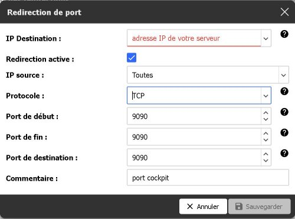

### **Introduction**

Ubuntu Server 22.04.03 s'enrichit d'une expérience de gestion système révolutionnaire grâce à l'intégration du programme Cockpit. Conçu pour simplifier la surveillance et la gestion des serveurs, Cockpit offre une interface web simple et intuitif, offrant aux administrateurs une vue d'ensemble de leur infrastructure.

**Qu'est-ce que Cockpit ?**

Cockpit est une interface d'administration légère et puissante qui permet de gérer des serveurs Ubuntu en utilisant simplement un navigateur web. Que vous soyez un administrateur chevronné ou que vous découvriez les joies de la gestion de serveurs, Cockpit offre une expérience utilisateur accessible et efficace, réduisant la complexité de la configuration et du suivi des systèmes.

**Fonctionnalités Clés**

1. Interface Web Intuitive : Cockpit propose une interface utilisateur basée sur le web, éliminant le besoin de se connecter en ligne de commande pour effectuer des tâches courantes de gestion.
2. Surveillance en Temps Réel : Obtenez une vue d'ensemble instantanée de la santé de votre serveur, y compris des informations détaillées sur l'utilisation du processeur, de la mémoire et du stockage.
3. Gestion des Packages : Installez, mettez à jour et gérez les packages logiciels avec facilité, le tout depuis votre navigateur.
4. Configuration du Réseau : Configurez les paramètres réseau, gérez les interfaces et assurez-vous de la connectivité de votre serveur.
5. Gestion des Utilisateurs et des Autorisations : Simplifiez la gestion des utilisateurs, attribuez des autorisations et contrôlez l'accès à vos systèmes.

**Pourquoi Utiliser Cockpit ?**

Que vous soyez un professionnel de l'informatique cherchant à optimiser la gestion de serveurs ou un débutant souhaitant une solution conviviale, Cockpit offre une approche centralisée pour administrer Ubuntu Server 22.04.03. Grâce à son interface accessible, vous pouvez prendre le contrôle de votre infrastructure sans sacrifier la puissance et la flexibilité nécessaires à une gestion
système efficace.

En somme, Cockpit redéfinit la gestion des serveurs Ubuntu en rendant la configuration et la surveillance plus accessibles que jamais. Découvrez une nouvelle manière de gérer votre infrastructure avec Cockpit sur Ubuntu Server 22.04.03.

Dans ce tutoriel, nous allons vous montrer comment installer et utiliser ce merveilleux logiciel de gestion de serveur sur votre serveur ubuntu 22.04.03 LTS.

### **Installation et présentation de cockpit**

Pour installer cockpit, rien de plus simple ! Vous avez juste à effectuer la commande suivante afin
d’installer le paquet sur votre serveur avec la commande suivante:

```
sudo apt install cockpit
```

Lorsque le logiciel est installé sur votre serveur, effectuer la commande:

```
ip a
```

Elle servira à afficher l'adresse IP de votre serveur


Voici l’adresse IP et le CIDR de mon serveur, le CIDR n’est pas nécessaire pour ce tuto.

Lorsque vous avez votre adresse IP, rendez vous sur votre navigateur internet et tapez votreadressip:9090, le :9090 est le port qui va vous diriger vers linterface cockpit.

Votre navigateur internet indiquera que vous accédez a un site dangereux, c’est tout à fait normal car votre certificat SSL n’est pas valide, et donc, n’est pas reconnu par votre navigateur. Faites quand même « avancé » puis, « accepter le risque et poursuivre ». Cette manipulation peut varier selon les navigateurs internet !

Vous serez alors redirigé vers une page de connexion, entrez les identifiants de connexion de votre serveur pour vous connecter à cockpit. (nom d’utilisateur et mot de passe).

Activez l’accès administrateur et entrez le mot de passe de votre serveur.

Vous voici sur l’interface web de cockpit !


L’interface web est divisé en deux parties, la partie « système » et la partie « outils ». Voici un petit tour de chaque onglet ;

 **Aperçu** : Cet onglet donne une vue d’ensemble des informations de votre serveur tel que les mises à jour, l’utilisation des ressources de votre PC le modèle de votre appareil et la configuration de votre serveur.

 **Journaux** : C’est comme un « historique », il recense toutes modifications apporté à votre serveur.

 **Stockage** : Comme son nom l’indique, elle sert à gérer le stockage, dans cette onglet, vous pouvez voir les différentes partitions montés sur votre serveur ainsi que les périphériques montés (tel que les clefs USB).

 **Réseau** :Cet onglet permet de voir la réception et la transmission du réseau.

 **Comptes** : Il sert à avoir accès aux différents utilisateurs enregistré sur votre serveur, normalement il y a l’utilisateur que vous avez créer lors de la configuration du serveur ainsi que l’utilisateur « root ».

 **Services** : Cet onglet liste les différents services tournant sur le serveur.

 **Application** : liste les applications cockpit.

 **Mises à jour logicielles** : Permet de mettre à jour les paquets.

 **Terminal** : Permet d’utiliser le terminal linux depuis l’interface web.

### **Utiliser Cockpit depuis l'extérieur**

Maintenant que vous connaissez cockpit, je vais vous montrer comment y accéder depuis une machine qui n’est pas sur votre réseau (un smartphone en 4G par exemple). Il faut juste autoriser la redirection vers le port 9090. **ATTENTION** : selon le routeur c'est une procédure différente qu'il faudra effectuer, ici on va le faire sur une FreeBox. Vous trouverez un tuto pour chaque marque de routeur en annexe.
Rendez vous sur le site de la box, généralement http://192.168.1.254, allez dans « paramètre de la box » puis dans « mode avancé » ensuite dans « gestion des ports » et pour finir « ajouter une redirection de port » veuillez suivre la capture d’écran ci-dessous afin de configurer votre redirection de port :



Faites ceci pour le protocole TCP et UDP, en ce qui me concerne, j’ai dû le faire en deux fois car sur FreeBox, on ne peut pas mettre les deux protocoles pour la même règle.

### **Testons!**

Vous pouvez tester facilement l’accès à cockpit depuis l’extérieur ! Il vous suffit d’un smartphone pour créer un point d’accès (un forfait mobile disposant de la 4G est nécessaire) et de votre PC !
Rendez vous sur votre smartphone, activez les données mobiles et le partage de connexion, modifiez le mode de passe si nécessaire, ces paramètres sont, en général, situer dans l’onglet «données cellulaires» ou «données mobiles» de votre smartphone.
Une fois cela fait, connectez votre PC à votre point d’accès mobile, c’est comme si vous souhaitez vous connecter en Wi-Fi !


Une fois connecté, renseignez vous sur l’adresse IP externe de votre routeur (la mienne commence par 82.67.X.X). Vous la trouverez facilement à partir de l’interface web de votre routeur/box.
Rendez vous dans votre navigateur internet et faites votre Ipexterieur:9090, pour ma part c’est : 82.67.X.X:9090

Et vous voila sur l’interface de connexion !


Entrez les identifiants de votre serveur et vous y êtes ! Vous pouvez accéder à cockpit depuis l’extérieur du réseau !


### **Conclusion**

En conclusion, notre démarche a abouti à la mise en place réussie d'un serveur doté d'une interface web appelée "cockpit". Cette interface offre la possibilité d'administrer le serveur à distance, une fonctionnalité particulièrement utile lorsque l'accès direct au serveur n'est pas disponible.

De plus, nous avons mis en œuvre une redirection de port au niveau du routeur, permettant ainsi un accès sécurisé à l'interface cockpit depuis l'extérieur du réseau local. Cette configuration optimisée offre une gestion à distance efficace, tout en garantissant la sécurité des opérations grâce à la redirection de port sur le routeur. En somme, notre solution offre une flexibilité et une accessibilité accrues pour la gestion du serveur, adaptée aux besoins des utilisateurs confrontés à des contraintes d'accès physique.

### **Annexe**

Tutoriels pour les redirection de port :
SFR: https://shorturl.at/gMO23

Bouygues Telecom: https://shorturl.at/gmzJ8

Orange: https://shorturl.at/ASUZ0

TP-Link: https://shorturl.at/jlPY2

Ubiquiti: https://shorturl.at/auCGO